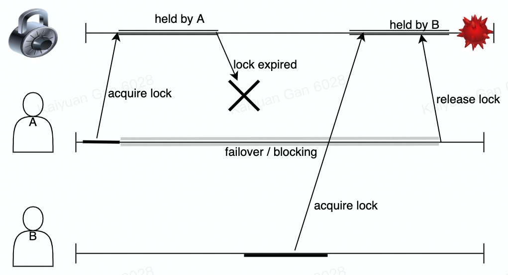
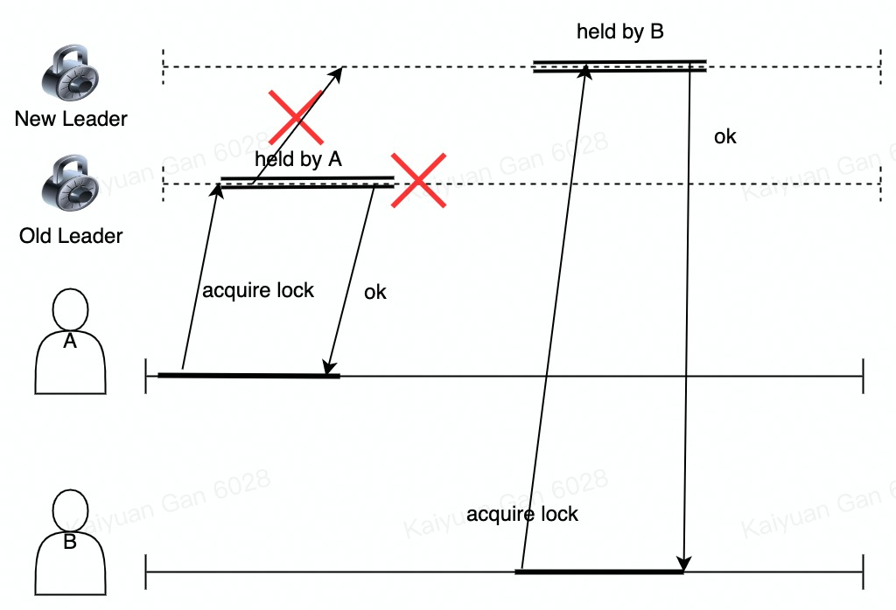

## Introduction

## Scenario

> Distributed locks are a very useful primitive in many environments where different processes must operate with shared resources in a mutually exclusive way.

Developers want to ensure that a shared resource (which can be an operation Update, or some content Read) on multi-instance nodes in the cluster can only be shared by one client at a time ( **mutual exclusion** ).

After reading the debate between Martin Kleppmann (DDIA Author) and Antirez (Father of Redis ) on whether the Redlock algorithm is safe, it is found that the application of distributed locks can actually be divided into different business scenarios:

- Efficiency: Using distributed locks can prevent different nodes from repeating the same work, but if the lock occasionally fails, it will not bring too severe impact. For example: a **verification code** is repeatedly sent.

- Correctness: The business expects that under no circumstances will there be an error situation, because once it happens, it will have a huge impact. For example: repeat transactions (deductions /additions ).

Based on the above analysis, the implementation of distributed locks usually has two schemes based on Redis and ZK to my knowledge. Their comparison is shown in the following table:

|                | 强一致                   | 高可用                         |
| -------------- | ------------------------ | ------------------------------ |
| 典型组件       | ETCD, ZooKeeper, Chubby  | Redis, Abase                   |
| 时延 (Latency) | 跨洋RTT 200ms            | 国内多机房 2ms 一次读写        |
| 优点           | 不会出现数据不一致的问题 | 脑裂切换的时候可能会出现不一致 |
| 缺点           | 延迟和吞吐受限           | 延迟极低，吞吐极大             |

The selection of distributed locks is based on the concept of a certain component at the beginning of the design. For example, the Redis distributed solution is designed to be a highly available model at the beginning. According to CAP, however, by consulting the official doc of Redis , I found that there are actually many open source practices that have introduced additional algorithms on top of the basic version of Redis to achieve business expectations.

### Distributed Lock Principle / Rules

- **Mutex (Consistency)**: At Anytime, there's only one client can have the lock.

- Safety: Avoid deadlock, when client failover blocking the lock, the lock should be release as well.

- **Availability:** Avoid standalone service, when the master node failover, there must be some follower node can take over and continue providing service.

- Reentran: For the same lock, only the process that acquired the lock can release the lock.


## Related Work

### Strong Consistency Distributed Lock

Based on strong consistency, we will have ZooKeeper, etcd , and Google's Chubby. In these implementations, ZK is based on the ZAB consensus algorithm and etcd is based on Raft. On the other hand, although Google proposed [chubby ](https://research.google.com/archive/chubby-osdi06.pdf)in the paper, the open source code has not been published, so Chubby is generally not used as a distributed lock solution, and Chubby has an open source version called ZooKeeper.

Chubby/ ZK is inspired by the file system and designed as a service for **metadata management** . Different from large files, these two systems are designed for small data, usually the data volume should be below 10G. Chubby internally achieves consistency through Paxos, and ZK ensures internal consistency through ZAB.

In addition to metadata management, ZK also supports the following:

- Distributed lock

- Coordination services: For example, the Master in the MapReduce can be implemented in ZK to issue tasks to idle workers.

- "Sequencer": write sequentially

For Raft-based etcd , it is clear that throughput and latency are limited by the performance of the Raft Group Leader. If we deploy our services across continents or IDCs , e.g. VA , SG , RU , EU  TTP , etc. The entire system must do transoceanic network transmission for communication. No matter where the leader is, the Follower must go far away to synchronize the RaftLog from the leader, so the performance will be very low.

> I have discussed with one of my friends who's from Tsinghua University about this problem and he provides me some basic insights that Leaderless / Multi-Leader Architecture might be able to ease this high latency problem.

For ZAB-based ZooKeeper, its latency should be smaller than ETCD , and the throughput should also meet the needs of the business. But from the monitoring point of view, SG 's cluster does not have much traffic, so it is speculated that the usage in SG's business should not be very large and the infra support is not quite well.

#### etcd Distributed Lock Implementation

> KV Pair form to do the lock, based on Raft guarantee Linearizability, high latency, in fact, the company's internal support scheme for ETCD and ByteKV similar.

I feel that the performance of these strongly consistent locks is very related to the deployment method, and it is impossible to generalize which method will be better than the other. And the fineness of different business scenarios is not the same. To my knowledge, business operations scenarios do not require very high mutual exclusion of critical sections, or there are some fall back strategies, which can reduce the dependence on strong consistency. Because the probability of the consistency problem of highly available distributed locks is relatively small after all, it may be painful to choose a strongly consistent KV with low availability for small probability events.

Etcd provides Lock API：

```
LOCK [options] <lockname> [command arg1 arg2 ...]
```

Description：LOCK acquires a distributed mutex with a given name. Once the lock is acquired, it will be held until **etcdctl** is terminated.

Options:

- ttl - time out in seconds of lock session. (Default Value: 60s).

If the client side does not release the lock due to some problem, other processes will be blocked by the time of the TTL . The default time of the TTL is 60s, which means that the lock service is unavailable during these 60s.

#### ZK Distributed Lock Implementation

Based on ZNode, the only way to use file namespace to do Mutex, based on the ZAB protocol to ensure synchronization between replicas, the delay is lower than that of Raft (further investigation is required).

The following code is written based on the understanding of Chubby. Maybe ZK will be slightly different. I only have limited time to look at ZK for the time being. I wrote it according to the previous understanding of Chubby's paper.

```Go
x = Open("/${PSM}/${biz_content}/resource_key")
if TryAcquire(x) == ok {
    // Lock Success
    SetContents(x, resource_random_value)
    reply(ok)
}else {
    // Lock failed
    reply(err)
}
```

### HA Distributed Lock

Based on the idea of High Availability, we will have Redis (-liked) storage system. Redis is the typical implementation in the industry. Though it might contradict with the principle idea of distributed lock, some programmers consider this mechanism due to easy implementation, low latency but sacrifice some consistency on the application layer. In which, the application has to ensure that even when there are some mistakes like two process enter the **critical region**, the application won't reveal some mistakes.

#### 3.2.1 Redis Distributed Lock Implementation (StandAlone)

- **Acquire Lock**

```Shell
SET resource_key resource_random_value NX PX 30000
SETNX
EXpire
```

1. PX: Add a TTL to the lock: To prevent deadlock when client acquires lock then permanently failover.

1. NX: To ensure mutex in distributed lock which means that only when ``resource_key``  is not exist, the process can acquire the lock.

1. ``resource_random_value``: some unique identifier which denotes the owner of the distributed lock to prevent process A wrongly release the lock own by process B.

**Counter Example:**



- **Release Lock**

The unlock operation is like a CAD (Compare and Delete) command, where the redis should maintain its atomic semantics.

- In Redis, we can use LUA script to implement this.

```Shell
if redis.call("get",KEYS[1]) == ARGV[1] then
    return redis.call("del",KEYS[1])
else
    return 0
end
```



### Redis Distributed Lock (Cluster + Redlock)

As can see from last part, the problem for **Naive Redis** Distributed Lock is the inconsistency during **Leader Transfering**. There has been a Algorithm, Redlock, proposed by Antires (father of Redis), might be able to handle this problem. The typical flow is described as below:

Assume that there are five node in a Redis Cluster, in order to acquire lock, the client performs the following operations:

1. START: Gets the current timestamp.

1. It tries to acquire locks in all the N instances sequentially, using the command described in 3.2.1. The client will set a small timeout compare to the valid time of lock. For example, if the TTL for lock is 10s, then the timeout for client waiting for nodes' reply may be around 5-50 ms. This prevents client waiting nodes' reply for so long and when there's a instance timeout, the client should immediately try next node in Redis Cluster.

1. After step:2 success, the client compute the current timestamp, END and minus START for the time of acquiring lock. If the time is under lock valid time and there are majority nodes reply ``ok`` of step:2 THEN

1. If the lock was successfully acquired, its validity time is considered to be the initial validity time minus the time elapsed in step:3.

1. If the client failed to acquire the lock ``(END-START > Lock valid time || less then majority nodes reply ok)``, then the client will try to unlock all the instances.

**[Clock Drift]**

The [time](https://lamport.azurewebsites.net/pubs/time-clocks.pdf) in Distributed System is not reliable due to network delay or atomic drifting. So any service that deploys across different server cannot rely on the TRUETIME assumption.

The [original redlock post](https://redis.io/docs/reference/patterns/distributed-locks/) states that the algorithm do not rely on synchronized clock and take clock drift in distributed system into account.

**[Retry on Failure]**

After the client fails to acquire the lock, it should sleep for a while so that other client will not synchronizing acquire lock which might give rise to a split brain (where no client can acquire the lock). Ideally, the client should try to send the SET command using multiplexing.

**[More Reliable]**

The client can extend the lock's TTL during the computation of lock's valid time. By sending an extension command with LUA script to all the instances that the key exist on, the client can extend the liveness of the lock, but should be stay within the validity time.

**[Performance, Crash Recovery and Fsync]**

- Persistence

Without persistence, the lock service cannot guarantee that mutex semantic. For example, when client A acquires the lock in 3 in 5 instances and one of the instances restarted, then we will have 3 instances are lock-free at this point.

AOF: Redis by default will fsync to disk by every seconds, it is possible that after a  restart, the lock key is missing. In theory, if we want to ensure any kind of instance start, we need to enable ``fsync=always`` but will affect performance due to DiskIO.

- Delay Restart

To guarantee that there's no two instance acquire lock at the same time, we can implement delay restart mechanism in which the shutdown server can only restart after ``TTL``. After it recover, all servers is clean and can be locked.

But there's downsides for this strategy when there are too many servers shutdown within ``TTL`` so that the lock service is unavailable for at least ``TTL``.

More Information about Redlock: There's a famous debate session within this topic between Martin Kleppmann (Distributed System Expert) and [Antirez](http://antirez.com/) (Father of Redis).

#### Analysis of Redlock

Martin Kleppmann [analyzed Redlock here](http://martin.kleppmann.com/2016/02/08/how-to-do-distributed-locking.html). A counterpoint to this analysis can be [found here](http://antirez.com/news/101).

## Conclusion

- Regarding distributed locks, the solutions that are better supported within the company can be distinguished according to high availability and strong consistency scenarios
    - High Availability Scenario: With Redis , businesses need to be compatible with inconsistent events with low probability.
    - Strongly consistent scheme: Using ByteKV :
        - For a single cluster across the room, the business needs to tolerate the delay of Raft synchronization across the room.
        - For multi-cluster cross-room, the business needs to tolerate that the service cannot write data to the leader of multiple clusters at the same time, otherwise unpredictable errors will occur.

Personally speaking, I think a better solution is to align with the overall service structure + business scenario, because different service structures may require different TradeOff, and different business scenarios have different preferences for different scenarios. But overall, through this survey, about a week before and after, I gained some understanding of the company and open source projects, including: ByteKV , ZooKeeper, Chubby, Redis , ETCD ; also let me The concept of distributed locks and business selection TradeOff has more experience.